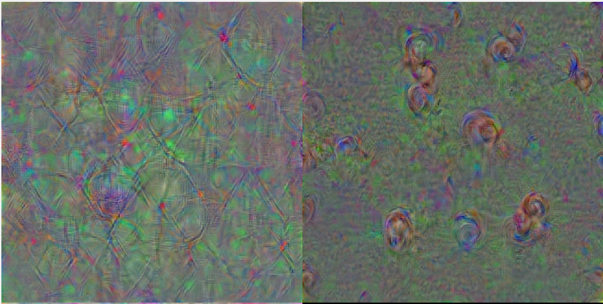
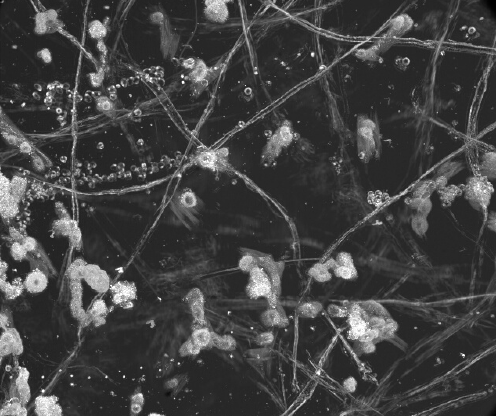

# Are You Meta?

 

RU-Meta is an assay that can differentiate between melanoma cells with high and low metastatic potentials using computational analysis.

### Deep Dream Images of Cells with High vs. Low Metastatic Potentials

### Projection Frames

### Watching Melanoma Dynamics

## Installing

`git clone https://github.com/NCBI-Hackathons/AreYouMeta.git`

## Built With

* [AlexNet](https://en.wikipedia.org/wiki/AlexNet) - A convolutional neural network we built upon

## Authors

https://www.u-hackmed.org/2018teams/team-8

* [Andrew Jamieson](https://github.com/andrewjUTSW) - *Team Lead*
* [Stephan Daetwyler](https://github.com/DaetwylerStephan)
* [Mahmoud Elgenedy](https://github.com/melgenedy)
* [Elizabeth Zou](https://github.com/wflms20110333)

[U-HACK MED 2018 Team 8 - Presentation](https://docs.google.com/presentation/d/1cjR6bhGudjFKzjLaKS5urVXQdpTvLTvg_o4uRU3KiH8/edit?usp=sharing)
